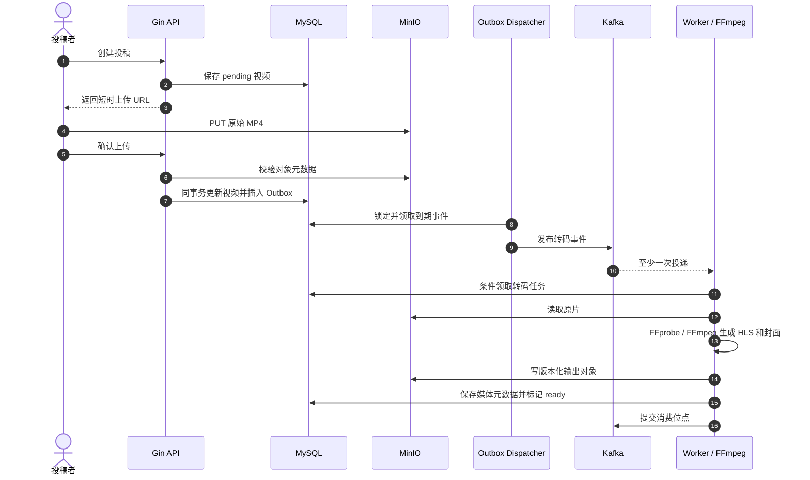
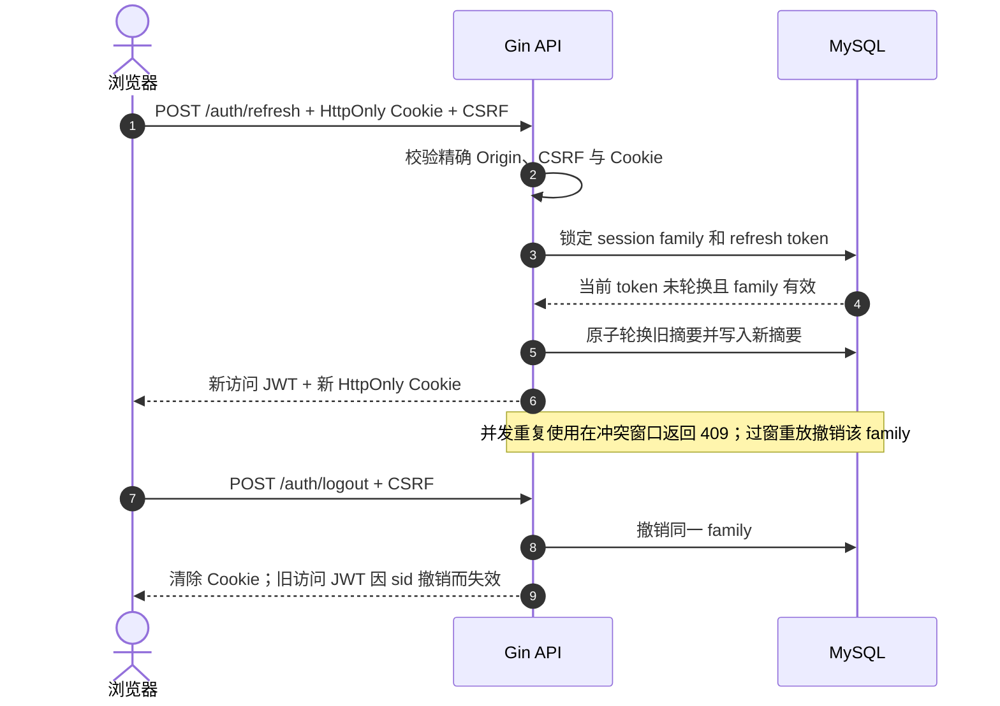
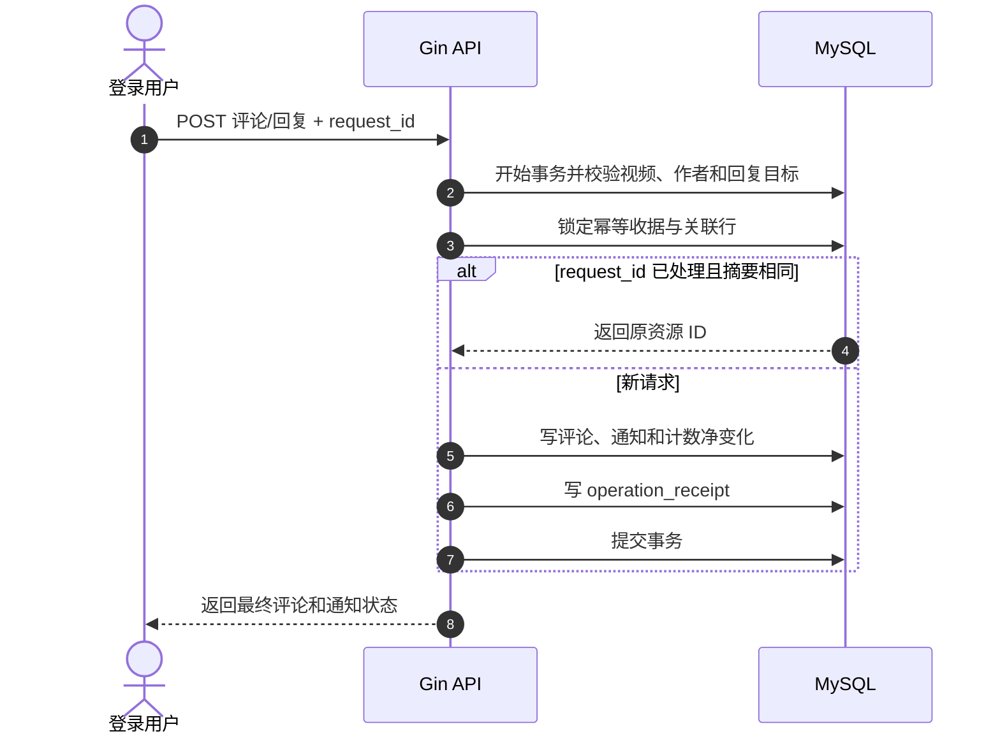

# Stage5 架构说明

MySQL 是用户、会话、视频、互动、通知、治理、观看指标与日指标的权威来源。MinIO 保存私有媒体；Kafka 传递 Outbox 转码事件；Worker 执行 FFprobe、FFmpeg 和 HLS 处理。Redis 只保存有限 TTL 的限流状态、分类缓存及可重建榜单候选。

```text
Browser ── Nginx ── Gin API ── MySQL
   │          │          ├──── Redis
   │          │          └──── Outbox ── Kafka ── Worker ── MinIO
   └──────────┴────────────────── 预签名媒体 URL
```

## 关键时序

### 投稿与异步转码



### 会话刷新与撤销



### 评论、通知与指标



## 一致性与故障恢复

- 视频状态与 Outbox 在同一 MySQL 事务提交。Kafka 和 Worker 按至少一次投递设计，任务条件更新及版本化对象路径控制重复处理。
- 会话族与 refresh 摘要存于 MySQL；刷新时行锁保护轮换，退出与改密撤销由数据库决定。Cookie 写操作要求 CSRF 和精确 Origin。
- 公开列表、关注流、推荐和榜单在返回前查询当前视频、作者与治理状态；Redis 缓存不决定权限。
- 榜单由 MySQL 日指标重建到临时 ZSET，再以锁所有者校验原子发布。Redis 丢失时回源 MySQL，数据库回源限流；容量耗尽返回 503。
- 有效观看依据服务端确认的可见播放墙钟增量；客户端进度只用于断点与完播判断，拖动不会增加观看时长。

## 运行方式

开发期 Vite 复用既有同源代理中间件。Compose 演示使用 Nginx 提供静态资源、页面深链回退和 `/api/` 同源代理。迁移以显式一次性进程执行。CI 分前端类型/测试/构建、Go 单元/race/vet/build、真实 MySQL/Redis/Kafka 集成与浏览器路由 E2E；完整业务浏览器闭环属于 T11 验收。
